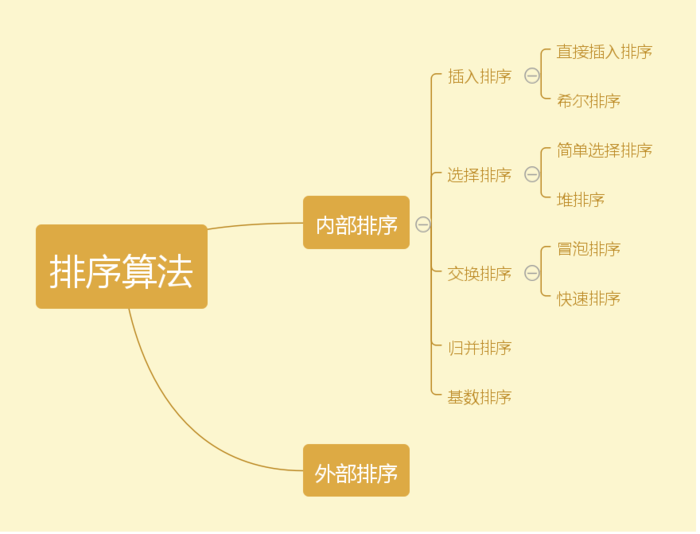
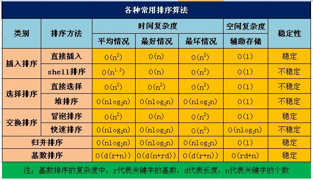

### 一. 排序
#### 概述
八大排序、三大查找是数据结构中非常基础的知识点。这里总结常见的八种排序算法

**八大排序分别如下:**

---
**八大排序的性能比较:**

---
**详细实现可查看下面**

（1）8种排序算法说明：
+ [1.1冒泡排序](bubble_sort.md)
+ [1.2插入排序](insertion_sort.md)
+ [1.3选择排序](selection_sort.md)
+ [1.4归并排序](merge_sort.md)
+ [1.5快速排序](quick_sort.md)
+ [1.6堆排序](heap_sort.md)
+ [1.7基数排序](radix_sort.md)
+ [1.8希尔排序](shell_sort.md)

（2）8种排序算法实现：
+ [1.1冒泡排序](./sources/bubbleSort.py)
+ [1.2插入排序](./sources/insertionSort.py)
+ [1.3选择排序](./sources/selectionSort.py)
+ [1.4归并排序](./sources/mergeSort.py)
+ [1.5快速排序](./sources/quickSort.py)
+ [1.6堆排序](./sources/heapSort.py)
+ [1.7基数排序](./sources/radixSort.py)
+ [1.8希尔排序](./sources/shellSort.py)
