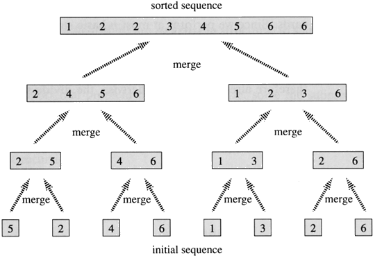

## Python 实现归并排序
### 一、 基本思想
归并排序是一种把多个有序序列合成一个有序序列的排序算法，其平均时间复杂度与快速排序、堆排序都是一样的为O（nlog(n)）。
实现：

（1）初始时，把序列的每个元素看成一个有序子序列，子序列长度为都为1.

（2）把序列两两归并，完成一遍后，每个子序列长度加倍。

（3）对加长的子序列重复上面的操作，最终将得到一个长度为n的有序序列。

这种排序方法称为归并排序。

### 二、图解

