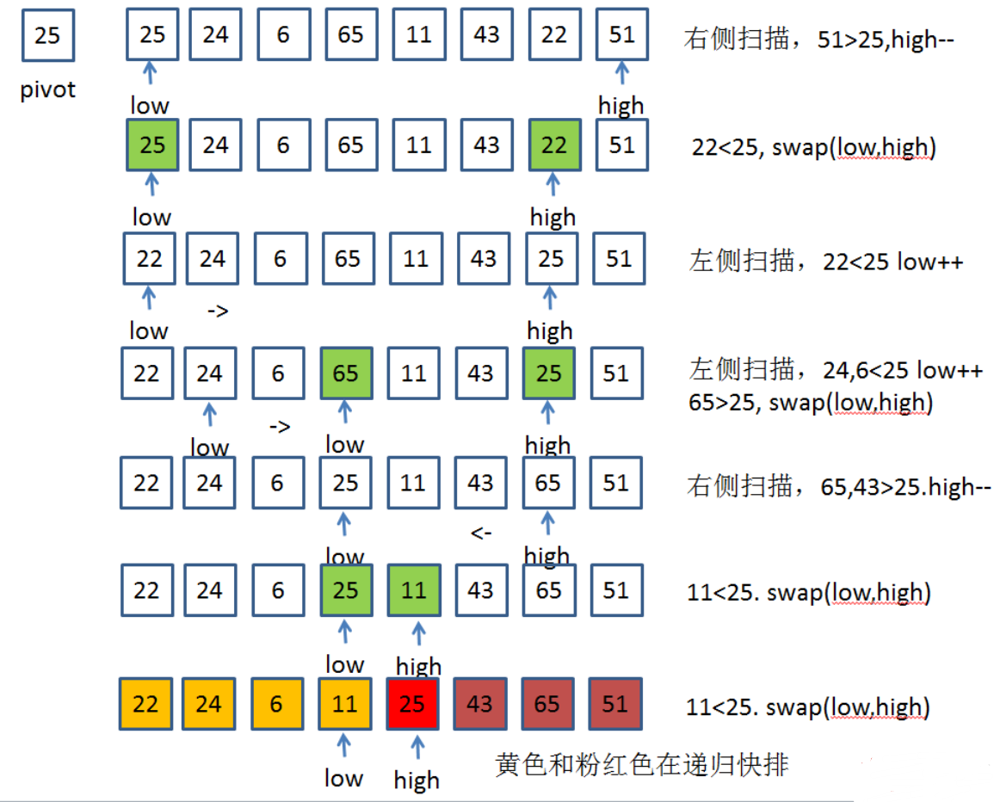

## Python 实现快排

#### 一、基本思想
##### 1.1 基本思想：
+ 快速排序采用的思想是分治思想。
+ 第一趟排序：快速排序是找出一个元素（理论上可以随便找一个）作为基准(pivot),然后对数组进行分区操作,使基准左边元素的值都不大于基准值,基准右边的元素值 都不小于基准值，如此作为基准的元素调整到排序后的正确位置。
+ 递归排序：第二步就是对高段位和地段为两部分进行递归排序。

##### 1.2 语言描述
一趟快速排序的算法的步骤是：
+ 1）设置两个变量low、high，排序开始的时候：low=0，high=N-1；
+ 2）以第一个数组元素作为关键数据，赋值给key，即key=A[0]；
+ 3）从high开始向前搜索，即由后开始向前搜索(high--)，找到第一个小于key的值A[high]，将A[high]和A[low]互换；
+ 4）从i开始向后搜索，即由前开始向后搜索(low++)，找到第一个大于key的A[low]，将A[low]和A[high]互换；
+ 5）重复第3、4步，直到low=high；

##### 1.3 算法复杂度分析
在最差的情况下，划分有 n 个元素构成的数组需要进行 n 次比较和 n 次移动，因此划分所需的时间为 O(n).在最差的情况下，每次主元会将数组划分成为一个大数组和一个空数组。这个大数组的规模是在上次划分的基础上减一。该算法需要 (n-1)+(n-2)+...+2+1=O(n^2).

在最佳的情况下，每次主元会将数组划分成为规模大致相等的部分。设T(n)标识使用快速排序算法堆包含 n 个元素的数组排序所需要的时间，因此，T(n)=T(n/2)+T(n/2)+n，即快速排序的T(n)=O(nlogn)


#### 二、快排伪代码

```
partition(arr,low, high)
    pivot = arr[high] # 选择最后一个元素作为 pivot
    i = low - 1 # i表示比pivot小的值的最大下标，即arr[low..i]都不大于pivot值
    for j = low to high # 从头开始扫描数组。arr[i+1, j-1]都大于pivot值
        if arr[j] <= pivot # 若当前元素不大于pivot的值，则把其与arr[i+1]交换
            i = i + 1
            exhange arr[i] with arr[j]
    exhange arr[i+1] with arr[high]
    return i+1
quickSort(arr, low, high)
    if low < high
        pi = partition(arr, low, high) # 此时下标为q的值已经确定了，后面的排序应该排除它
        quickSort(arr, low, pi-1)
        quickSort(arr, pi+1, high)
       return arr
# 对子数组arr[low..high]进行原址重排。O(n), n=high-low+1


```

>注：上面代码为升序，如需要改为降序，请将条件由 "arr[j] <= pivot" 改为 "arr[j] > pivot"


#### 四、图解快排


