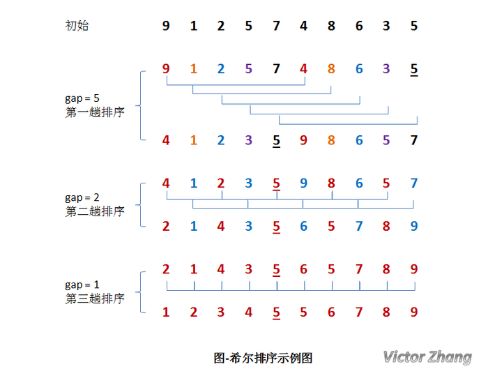

### 1.8 Python 希尔排序
#### 1.3.1 概述
 希尔排序(Shell Sort)是插入排序的一种。也称缩小增量排序，是直接插入排序算法的一种更高效的改进版本,该方法的基本思想是：先将整个待排元素序列分割成若干个子序列（由相隔某个“增量”的元素组成的）分别进行直接插入排序，然后依次缩减增量再进行排序，待整个序列中的元素基本有序（增量足够小）时，再对全体元素进行一次直接插入排序。因为直接插入排序在元素基本有序的情况下（接近最好情况），效率是很高的，因此希尔排序在时间效率比直接插入排序有较大提高。
 
#### 1.3.2 算法描述
```text
input: 数组长度为 n，数组下标为 0 到 n − 1
　　inc ← round(n/2)
　　while inc > 0 do:
　　  for i = inc .. n − 1 do:
　　      temp ← a[i]
　　      j ← i
　　      while j ≥ inc and a[j − inc] > temp do:
　　          a[j] ← a[j − inc]
　　          j ← j − inc
　　      a[j] ← temp
　　  inc ← round(inc / 2)

```
#### 1.3.3 语言描述
```text
插入排序的方法进行排序；每次将 gap 折半减小，循环上述操作；当 gap = 1 时，利用直接插入，完成排序。
希尔排序的总体实现应该由三个循环完成：

    第一层循环：将 gap 依次折半，对序列进行分组，直到 gap=1
    第二、三层循环：也即直接插入排序所需要的两次循环。
```

#### 1.3.4 Example

##### 希尔排序图示


##### 动态图描述


